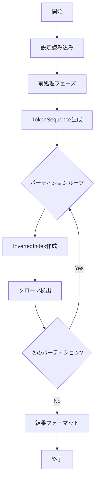

# NIL アーキテクチャドキュメント

このドキュメントでは、NIL（N-gram, Inverted index, LCS）の内部アーキテクチャと実装詳細について説明します。

## 目次

1. [システムアーキテクチャ](#システムアーキテクチャ)
2. [コアコンポーネント](#コアコンポーネント)
3. [処理フロー](#処理フロー)
4. [データ構造](#データ構造)
5. [並列処理戦略](#並列処理戦略)

---

## システムアーキテクチャ

NIL は以下の 3 層アーキテクチャで構成されています：

```
┌─────────────────────────────────────────┐
│         Presentation Layer              │
│  (CLI, Logger, Output Formatter)        │
└─────────────────────────────────────────┘
                  ↓
┌─────────────────────────────────────────┐
│          Use Case Layer                 │
│  (Preprocess, Clone Detection)          │
└─────────────────────────────────────────┘
                  ↓
┌─────────────────────────────────────────┐
│           Entity Layer                  │
│  (TokenSequence, InvertedIndex, LCS)    │
└─────────────────────────────────────────┘
```

---

## コアコンポーネント

### 1. Presentation Layer

#### NILMain

- **役割**: アプリケーションのエントリーポイント
- **責務**:
  - 設定の読み込み
  - ユースケースの実行
  - 結果の出力

#### LoggerWrapper

- **役割**: ログ出力の抽象化
- **実装**:
  - 標準モード: 進捗情報を標準出力
  - MIF モード: 出力ファイル名のみを標準出力

#### Format

- **役割**: 出力形式の変換
- **実装**:
  - `CSV`: 標準 CSV 形式
  - `BCEFormat`: BigCloneEval 互換形式

### 2. Use Case Layer

#### Preprocess

前処理を担当するコンポーネント群：

- **PreprocessFactory**: 言語に応じた前処理クラスの生成
- **AntlrTransformer**: ANTLR を用いた字句解析
- **SymbolSeparator**: 記号の分離処理

**対応言語別実装:**

- `JavaPreprocess`: Java 用前処理
- `CPreprocess`: C 用前処理
- `CppPreprocess`: C++用前処理
- `CSharpPreprocess`: C#用前処理
- `PythonPreprocess`: Python 用前処理
- `KotlinPreprocess`: Kotlin 用前処理

#### Clone Detection

クローン検出を担当するコンポーネント群：

##### OptimizedCloneDetection

- **役割**: 最適化されたクローン検出の統括
- **処理フロー**:
  1. Location: N-gram ベースの候補特定
  2. Filtration: 初期フィルタリング
  3. Verification (N-gram): N-gram 類似度による検証
  4. Verification (LCS): LCS 類似度による最終検証

##### NGramBasedLocation

- **役割**: 転置インデックスを用いた高速候補検索
- **アルゴリズム**:
  - N-gram の共通度に基づく候補ペアの特定
  - インデックス検索による O(1) アクセス

##### NGramBasedFiltration

- **役割**: N-gram 類似度の計算とフィルタリング
- **類似度計算**:
  ```
  similarity = (共通N-gram数 × 2) / (A のN-gram数 + B のN-gram数) × 100
  ```

##### LCSBasedVerification

- **役割**: LCS（最長共通部分列）による厳密な類似度検証
- **アルゴリズム**: Hunt-Szymanski LCS
- **類似度計算**:
  ```
  similarity = (LCS長 × 2) / (A のトークン数 + B のトークン数) × 100
  ```

### 3. Entity Layer

#### TokenSequence

- **役割**: トークン列の表現
- **属性**:
  - `id`: 一意識別子
  - `filePath`: ソースファイルパス
  - `startLine`, `endLine`: コード片の行範囲
  - `tokens`: トークンのリスト

#### InvertedIndex

- **役割**: N-gram から TokenSequence への転置インデックス
- **構造**:
  ```
  Map<NGram, List<TokenSequenceID>>
  ```
- **作成方法**:
  - スライディングウィンドウで N-gram を生成
  - 各 N-gram に対応する TokenSequence を登録

#### HuntSzymanskiLCS

- **役割**: 高速な LCS 計算
- **計算量**: O((r + n) log n)
  - r: マッチ数
  - n: シーケンス長
- **利点**: 動的計画法（O(mn)）より高速

---

## 処理フロー

### 全体フロー



### 詳細フロー

#### 1. 前処理フェーズ

```
入力: ソースディレクトリ
  ↓
ファイル探索（対象拡張子のみ）
  ↓
各ファイルに対して:
  ├─ ANTLR字句解析
  ├─ トークン正規化
  ├─ 記号分離
  └─ フィルタリング（minLine, minToken）
  ↓
TokenSequenceリスト生成
  ↓
出力: List<TokenSequence>
```

#### 2. クローン検出フェーズ

```
入力: List<TokenSequence>, パーティション設定
  ↓
パーティション毎に:
  ├─ InvertedIndex作成
  │   └─ N-gram生成とインデックス登録
  ↓
  └─ 各TokenSequenceペアに対して:
      ├─ Location (候補特定)
      │   └─ InvertedIndexから類似候補を検索
      ├─ Filtration (初期フィルタ)
      │   └─ N-gram類似度 >= filtrationThreshold?
      ├─ N-gram Verification
      │   └─ N-gram類似度 >= verificationThreshold?
      └─ LCS Verification
          └─ LCS類似度を計算
  ↓
出力: ClonePairリスト
```

#### 3. 出力フェーズ

```
入力: clone_pairs（中間ファイル）
  ↓
フォーマット選択:
  ├─ 標準形式
  │   └─ フルパス形式のCSV
  └─ BCE形式
      └─ ディレクトリ/ファイル分離形式のCSV
  ↓
出力: 結果CSVファイル
```

---

## データ構造

### TokenSequence

```kotlin
data class TokenSequence(
    val id: Int,
    val filePath: String,
    val startLine: Int,
    val endLine: Int,
    val tokens: List<Token>
)
```

### InvertedIndex

```kotlin
class InvertedIndex {
    private val index: Map<NGram, MutableList<Int>>

    fun search(ngram: NGram): List<Int>

    companion object {
        fun create(
            partitionSize: Int,
            gramSize: Int,
            tokenSequences: List<TokenSequence>,
            startIndex: Int
        ): InvertedIndex
    }
}
```

### CloneResult

```kotlin
data class CloneResult(
    val id1: Int,
    val id2: Int,
    val nGramSimilarity: Double,
    val lcsSimilarity: Double?
)
```

---

## 並列処理戦略

### 前処理の並列化

```kotlin
files.parallelStream()
    .map { file -> preprocess(file) }
    .collect(Collectors.toList())
```

- **粒度**: ファイル単位
- **スケジューラ**: ForkJoinPool
- **同期**: 不要（各ファイルは独立）

### クローン検出の並列化

```kotlin
Flowable.range(startIndex + 1, tokenSequences.size - startIndex - 1)
    .parallelIfSpecified(config.threads)
    .runOn(Schedulers.computation())
    .flatMap { cloneDetection.exec(it) }
    .sequential()
    .blockingSubscribe { result ->
        writeResult(result)
    }
```

- **粒度**: TokenSequence 単位
- **フレームワーク**: RxJava 3
- **スレッド数**: `-t` オプションで指定（デフォルト: 全コア）
- **結果の同期**: sequential で順序保証、blockingSubscribe で同期書き込み

### パーティション分割戦略

大規模コードベースに対する最適化：

```kotlin
val partitionSize = (tokenSequences.size + config.partitionNum - 1) / config.partitionNum

repeat(config.partitionNum) { i ->
    val startIndex = i * partitionSize
    val invertedIndex = InvertedIndex.create(
        partitionSize,
        config.gramSize,
        tokenSequences,
        startIndex
    )
    // クローン検出...
}
```

**利点:**

- メモリ使用量の削減
- キャッシュ効率の向上
- 進捗の可視化

---

## 最適化技法

### 1. Early Termination

フィルタリングフェーズで早期に候補を除外：

```kotlin
if (ngramSimilarity < filtrationThreshold) {
    return emptyList() // 早期リターン
}
```

### 2. Lazy Evaluation

RxJava のストリーム処理による遅延評価：

```kotlin
flowable
    .filter { /* filtration */ }
    .map { /* verification */ }
    .subscribe { /* output */ }
```

### 3. Index-based Search

転置インデックスによる O(1) 検索：

```kotlin
val candidates = invertedIndex.search(ngram)
```

### 4. Hunt-Szymanski LCS

従来の動的計画法（O(mn)）よりも高速な O((r+n)logn) アルゴリズム

---

## メモリ管理

### メモリ使用量の見積もり

```
推定メモリ使用量 =
    TokenSequences × 平均トークン数 × TokenSize +
    InvertedIndex × (パーティションサイズ / 全体サイズ) +
    並列処理バッファ × スレッド数
```

### GC 最適化

大規模プロジェクトの場合の推奨 JVM オプション：

```bash
java -Xmx16g \
     -XX:+UseG1GC \
     -XX:MaxGCPauseMillis=200 \
     -jar NIL-all.jar -s /path/to/source
```

---

## 拡張性

### 新しい言語のサポート

新しい言語を追加する手順：

1. `Language` enum に追加
2. ANTLR 文法ファイルを作成（`src/main/antlr/`）
3. `XxxPreprocess.kt` を実装（`PreprocessFactory` で登録）
4. テストケースを追加

### カスタム類似度メトリクス

新しい類似度計算方法を追加：

1. `Verification` インターフェースを実装
2. `CloneDetection` で使用
3. `CloneResult` に新しいフィールドを追加

---

## テスト戦略

### ユニットテスト

- `src/test/kotlin/` 配下にテストケース
- JUnit 5 を使用
- モック: Mockito

### 統合テスト

- サンプルプロジェクトでのエンドツーエンドテスト
- 期待される結果との比較

### パフォーマンステスト

- ベンチマークプロジェクト
- 処理時間とメモリ使用量の測定

---

## 参考資料

- [使用ガイド](./NIL_USAGE_GUIDE.md)
- [実験方法](../EXPERIMENT.md)
- [メソッド追跡](../METHOD_TRACKING.md)
- FSE '21 論文: [camera-ready.pdf](../camera-ready.pdf)
